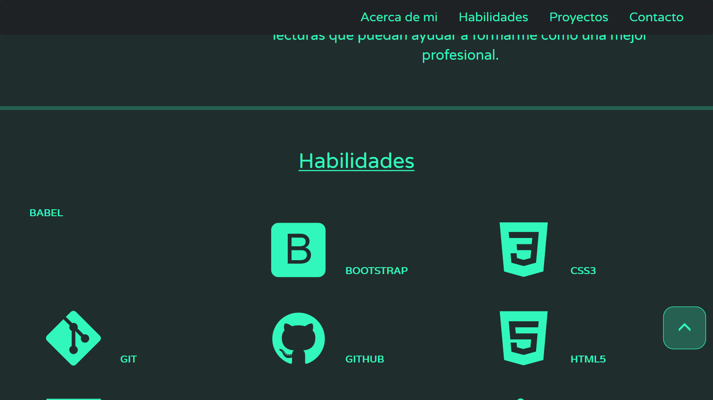
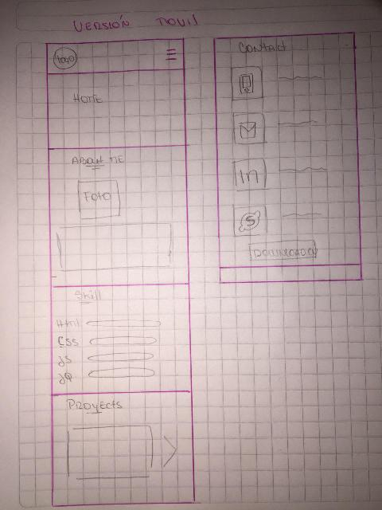

# Portafolio: Genoveva Villablanca

## Descripción

Portafolio de presentación web
Ccontenido:

+ Acerca de mi
+ Skills
+ Proyectos
+ Contacto

Entre las funcionalidades que tiene la web esta: 

+ Navbar al presionar las opciones redirecciona a las secciones correspondientes
+ Al pasar el mouse sobre las habilidades, botones e imagenes se activan los hover
+ Para saber la información de los proyectos se presiona en la imagen y se muestra la informacion de ello
+ Al presionar botones de demo direcciona a las paginas en gh-pages
+ Al presionar github redirecciona a los repositorios en github que albergan las app
+ En contacto al presionar los botones se puede:
    1. Mail: Permite enviar un correo a mi cuenta que corresponde, abriendo la aplicacion de correo predeterminado del dispositivo
    2. Linkedin: Redirecciona a mi cuenta de linkedin
    3. Skype: Muestra mi información de skype
    4. Github: Redirecciona a mi perfil de github
+ Al presionar icono de curriculum, descarga curriculum version pdf
+ Incorporacion de boton volver arriba
+ Incorporación de slider en versión movil

## Prototipo de colores

